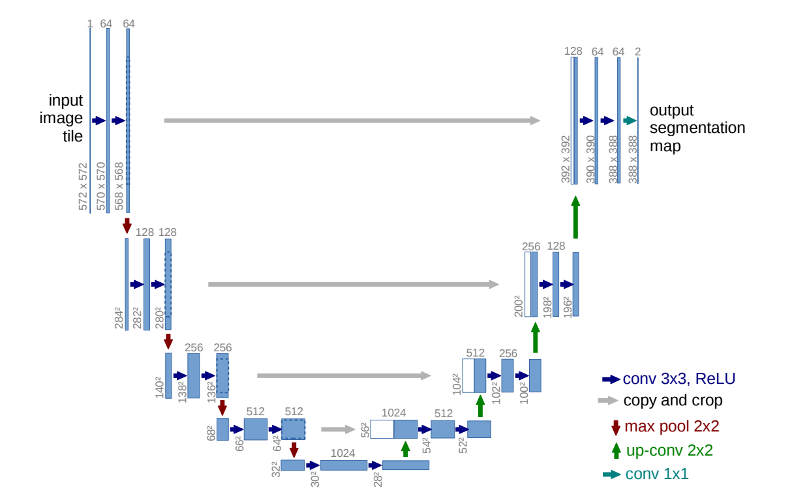

# BMEN4460 Notebook 3 (A Multi-Notebook Series)
## Brain Tumor Segmentation with U-Net and Its Variants
Nanyan "Rosalie" Zhu and Chen "Raphael" Liu

### Overview
This repository is a child repository of [**RnR-2018/Deep-learning-with-PyTorch-and-GCP**](https://github.com/RnR-2018/Deep-learning-with-PyTorch-and-GCP). This serves a primary purpose of facilitating the course BMEN4460 instructed by Dr. Andrew Laine and Dr. Jia Guo at Columbia University. However, it can also be used as a general beginner-level tutorial to implementing deep learning algorithms with PyTorch on Google Cloud Platform.

This repository, [**Brain Tumor Segmentation**](https://https://github.com/RnR-2018/BMEN4460-NB3-brain_tumor_segmentation), aims to give you an idea how to approach a medical computer vision project. This brain tumor segmentation series, consisting of three jupyter notebooks, will walk you through the essential steps of building up your own project. As you progress along these three notebooks, you will see incremental elements being added and (hopefully) performance being improved.

For students in BMEN4460 (or who follow the instructions Step00 through Step02 in the parent repository), please create a Projects folder (if you have not done yet) within your GCP VM and download this repository into that folder.

On the GCP VM Terminal:
```
cd /home/[username]/
mkdir BMEN4460 # This is only necessary if you have not done this yet
mkdir BMEN4460/BrainTumor # This is only necessary if you have not done this yet
cd BMEN4460/BrainTumor
git clone https://github.com/RnR-2018/BMEN4460-NB3-brain_tumor_segmentation/
```

If it says "fatal: could not create work tree dir ...", you may as well try it again with super user permission
```
sudo git clone https://github.com/RnR-2018/BMEN4460-NB3-brain_tumor_segmentation/
```

You shall then see the following hierarchy of files and folders, hopefully, which matches the hierarchy of the current repository.

```
BMEN4460-NB3-brain_tumor_segmentation
    ├── Unet_architecture.PNG
    ├── BMEN4460-NB3-brain_tumor_segmentation_approach01.ipynb
    └── dataset
        └── png_dataset
            └── ...
```

## Acknowledgements
This notebook series is largely inspired by and adapted from [this GitHub repository](https://github.com/sdsubhajitdas/Brain-Tumor-Segmentation). It's a pretty well-organized repository with surprisingly few stars. We recommend giving it a star when you have time.

## Network Architectures implemented in this tutorial.

### 1. The Basic U-Net Model (with minor changes to reduce the memory requirements).
Illustration directly taken from the [U-Net publication](https://arxiv.org/abs/1505.04597).


